# Cross-Language TaskFlow

A small multi-service Todo web application demonstrating a cross-language architecture:
- **Auth Service (Python/Flask)** — user signup/login, JWT issuance
- **Todo Service (Node/Express)** — CRUD for todos (JWT-protected)
- **Analytics Service (Go)** — aggregate stats (completed vs pending)
- **Frontend (React + Vite)** — simple UI
- **MongoDB** — shared database

---

## 1) Repository Layout

```
webapp/
  auth_service/           # Flask app (Python)
    app.py
    models.py
    utils.py
    requirements.txt
    README.md
  todo_service/           # Express app (Node.js)
    server.js
    package.json
    README.md
  analytics_service/      # Go service
    main.go
    go.mod
    README.md
  frontend_complete/      # React + Vite frontend
    src/
    index.html
    package.json
    README.md
```

---

## 2) Quickstart

You can run the stack either with **Docker Compose (recommended)** or **locally**.
All services expect a **MongoDB** instance.

### Option A — Docker Compose (one command)
1. Ensure Docker & Docker Compose are installed.
2. From the project root (where your code is), create a `run-pack/compose.yml` using the template below or use the prebuilt zip from this assistant.
3. Run:
   ```bash
   docker compose -f run-pack/compose.yml up --build
   ```
4. Open:
   - Frontend: http://localhost:5173
   - Auth:     http://localhost:8001/health
   - Todo:     http://localhost:8002/health
   - Analytics:http://localhost:8003/health

<details>
<summary>compose.yml (reference)</summary>

```yaml
version: "3.9"
services:
  mongo:
    image: mongo:6
    ports: ["27017:27017"]
    volumes: ["mongo_data:/data/db"]

  auth_service:
    build:
      context: ./webapp/auth_service
    environment:
      - MONGO_URI=mongodb://mongo:27017
      - DB_NAME=taskflow
      - JWT_SECRET=devsecret
    ports: ["8001:8001"]
    depends_on: [mongo]

  todo_service:
    build:
      context: ./webapp/todo_service
    environment:
      - MONGO_URI=mongodb://mongo:27017
      - DB_NAME=taskflow
      - JWT_SECRET=devsecret
    ports: ["8002:8002"]
    depends_on: [mongo, auth_service]

  analytics_service:
    build:
      context: ./webapp/analytics_service
    environment:
      - MONGO_URI=mongodb://mongo:27017
      - DB_NAME=taskflow
      - PORT=8003
    ports: ["8003:8003"]
    depends_on: [mongo]

  frontend:
    build:
      context: ./webapp/frontend_complete
    environment:
      - VITE_AUTH_URL=http://localhost:8001
      - VITE_TODO_URL=http://localhost:8002
      - VITE_ANALYTICS_URL=http://localhost:8003
    ports: ["5173:80"]
    depends_on: [auth_service, todo_service, analytics_service]

volumes:
  mongo_data:
```
</details>

### Option B — Local runs (separate terminals)

#### Start MongoDB (Docker)
```bash
docker run -d --name mongo -p 27017:27017 -v mongo_data:/data/db mongo:6
```

#### 1) Auth Service (Flask, port 8001)
```bash
cd webapp/auth_service
python3 -m venv venv
source venv/bin/activate
pip install -r requirements.txt
export MONGO_URI="mongodb://localhost:27017"
export DB_NAME="multi_lang_todo"
export JWT_SECRET="your_secret_key_here"
export JWT_EXPIRE_DAYS="7"
python app.py
```

#### 2) Todo Service (Express, port 8002)
```bash
cd webapp/todo_service
npm install
export MONGO_URI="mongodb://localhost:27017"
export DB_NAME="multi_lang_todo"
export JWT_SECRET="your_secret_key_here"
npm start
```

#### 3) Analytics Service (Go, port 8003)
```bash
cd webapp/analytics_service
go mod tidy
export MONGO_URI="mongodb://localhost:27017"
export DB_NAME="multi_lang_todo"
export PORT="8003"
go run main.go
```

#### 4) Frontend (React+Vite, dev server port 5173)
```bash
cd webapp/frontend_complete
npm install
npm install react-icons
export VITE_AUTH_URL="http://localhost:8001"
export VITE_TODO_URL="http://localhost:8002"
export VITE_ANALYTICS_URL="http://localhost:8003"
npm run dev
# Open http://localhost:5173
```

---
---

## 2.1) Local Installation (Detailed Guide)

This section walks you through a **clean, step‑by‑step local installation** for Linux/macOS. Windows users can run the same commands inside WSL2 or adapt to PowerShell.

### A) Prerequisites
- **Python 3.11+** (or 3.12) with `venv`
- **Node.js 18+** and **npm**
- **Go 1.21+**
- **Docker** (only needed if you prefer to run MongoDB in Docker, which we recommend)

> Tip: On Ubuntu: `sudo apt-get update && sudo apt-get install -y python3-venv nodejs npm golang`  
> On macOS (Homebrew): `brew install python node go docker`

### B) Start MongoDB (via Docker)
```bash
docker run -d --name mongo -p 27017:27017 -v mongo_data:/data/db mongo:6
```
If you have a local MongoDB installation, ensure it listens on `mongodb://localhost:27017`.

### C) Create `.env` files (recommended)

Create a `.env` file in each service directory with the following content.

**1) `webapp/auth_service/.env`**
```
MONGO_URI=mongodb://localhost:27017
DB_NAME=multi_lang_todo
JWT_SECRET=your_secret_key_here
JWT_EXPIRE_DAYS=7
```

**2) `webapp/todo_service/.env`**
```
MONGO_URI=mongodb://localhost:27017
DB_NAME=multi_lang_todo
JWT_SECRET=your_secret_key_here
PORT=8002
```

**3) `webapp/analytics_service/.env`**
```
MONGO_URI=mongodb://localhost:27017
DB_NAME=multi_lang_todo
PORT=8003
```

**4) `webapp/frontend_complete/.env`**
```
VITE_AUTH_URL=http://localhost:8001
VITE_TODO_URL=http://localhost:8002
VITE_ANALYTICS_URL=http://localhost:8003
```

### D) Install dependencies per service

**Auth (Flask)**
```bash
cd webapp/auth_service
python3 -m venv venv
source venv/bin/activate
pip install -r requirements.txt
```

**Todo (Express)**
```bash
cd webapp/todo_service
npm install
```

**Analytics (Go)**
```bash
cd webapp/analytics_service
go mod tidy
```

**Frontend (React + Vite)**
```bash
cd webapp/frontend_complete
npm install
npm install react-icons
```

### E) Run everything (4 terminals)

**Terminal 1 — Auth**
```bash
cd webapp/auth_service
source venv/bin/activate
python app.py     # starts on :8001
```

**Terminal 2 — Todo**
```bash
cd webapp/todo_service
npm start         # starts on :8002
```

**Terminal 3 — Analytics**
```bash
cd webapp/analytics_service
go run main.go    # starts on :8003
```

**Terminal 4 — Frontend**
```bash
cd webapp/frontend_complete
npm run dev       # opens Vite dev server on :5173
```

Open the UI at **http://localhost:5173**.

### F) Quick end‑to‑end smoke test
Use the **Auth** service to obtain a token, then call **Todo** APIs with that token. Analytics should reflect counts for the authenticated username. See section **“5) Quick Smoke Tests (curl)”** below for copy‑paste commands.

---

## 3) Environment Variables

### Auth Service (Flask)
- `MONGO_URI` (e.g., `mongodb://localhost:27017`)
- `DB_NAME` (e.g., `multi_lang_todo`)
- `JWT_SECRET` (required)
- `JWT_EXPIRE_DAYS` (default `7`)

### Todo Service (Express)
- `MONGO_URI` (or `MONGO_URL`) — choose one consistently
- `DB_NAME`
- `JWT_SECRET` (must match Auth’s secret for JWT verification)

### Analytics Service (Go)
- `MONGO_URI`
- `DB_NAME`
- `PORT` (default `8003`)

### Frontend (Vite)
- `VITE_AUTH_URL`
- `VITE_TODO_URL`
- `VITE_ANALYTICS_URL`

---

## 4) API Endpoints

### Auth (port 8001)
- `POST /signup` — `{ name, username, email, password }`
- `POST /login` — `{ username, password }` → `{ token }`
- `GET /me` — header `Authorization: Bearer <token>`
- `GET /health`

### Todo (port 8002) — JWT required
- `GET /todos`
- `POST /todos` — `{ title, description, dueDate? }`
- `PUT /todos/:id` — `{ title?, description?, completed? }`
- `DELETE /todos/:id`
- `GET /health`

### Analytics (port 8003)
- `GET /analytics/:username`
- `GET /health`

---

## 5) Quick Smoke Tests (curl)

### Auth
```bash
# Health
curl http://localhost:8001/health

# Signup
curl -X POST http://localhost:8001/signup   -H "Content-Type: application/json"   -d '{"name":"Jakir","username":"jakir","email":"jakir@example.com","password":"123456"}'

# Login → capture token
TOKEN=$(curl -s -X POST http://localhost:8001/login   -H "Content-Type: application/json"   -d '{"username":"jakir","password":"123456"}' | jq -r .token)

# Me
curl -H "Authorization: Bearer $TOKEN" http://localhost:8001/me
```

### Todo
```bash
# Create
curl -X POST http://localhost:8002/todos   -H "Content-Type: application/json"   -H "Authorization: Bearer $TOKEN"   -d '{"title":"Buy groceries","description":"Milk, eggs, bread","dueDate":"2025-08-20"}'

# List
curl -H "Authorization: Bearer $TOKEN" http://localhost:8002/todos

# Edit / Complete
curl -X PUT http://localhost:8002/todos/TODO_ID_HERE   -H "Content-Type: application/json"   -H "Authorization: Bearer $TOKEN"   -d '{"completed":true}'

# Delete
curl -X DELETE http://localhost:8002/todos/TODO_ID_HERE   -H "Authorization: Bearer $TOKEN"
```

### Analytics
```bash
curl http://localhost:8003/health
curl http://localhost:8003/analytics/jakir
```

---

## 6) Architecture & Flow (Mermaid)

### System Architecture


### Auth Flow

```mermaid
sequenceDiagram
  participant U as User
  participant FE as Frontend
  participant AU as Auth Service
  participant DB as MongoDB
  U->>FE: Enter credentials
  FE->>AU: POST /login {username, password}
  AU->>DB: find_user_by_username
  DB-->>AU: user + hash
  AU->>AU: bcrypt.verify + sign JWT
  AU-->>FE: 200 {token}
  FE-->>U: Store token
```


### Todo Flow


---

## 7) Troubleshooting

- **JWT mismatch**: Make sure `JWT_SECRET` is identical in Auth and Todo.
- **CORS**: If the browser blocks requests, set explicit CORS origins for `http://localhost:5173`.
- **Mongo connection**: Verify `mongo` container is up and `MONGO_URI` points to it.
- **Ports already in use**: Change published ports in Compose or local runs.

---

## 8) Notes

- Use strong secrets in production.
- Add proper rate limiting and validation for production environments.
- Consider using a gateway/reverse proxy for unified routing and TLS.
